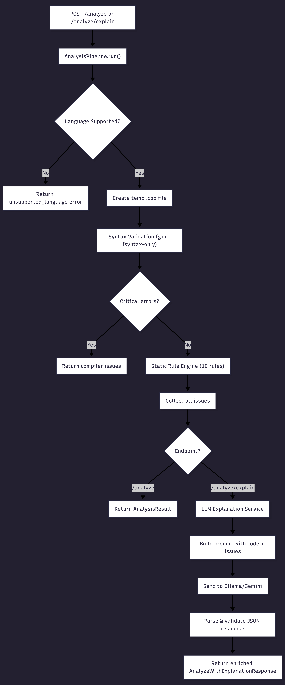
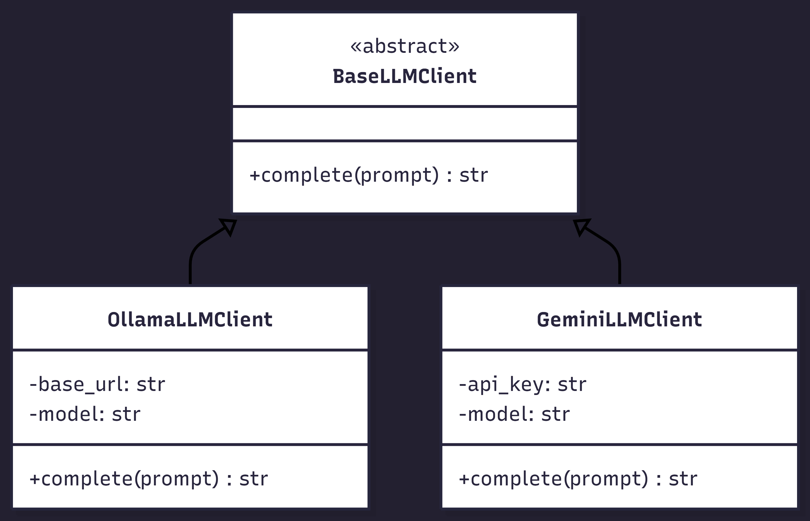
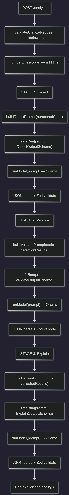
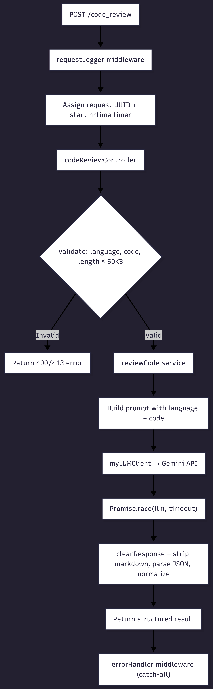
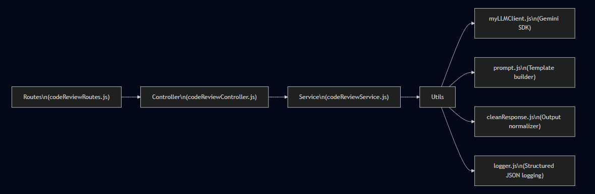
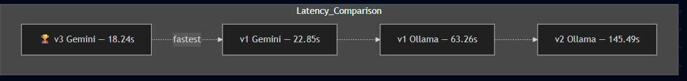
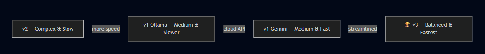

# 🔬 Intelligence Engine — Comparative Analysis Report

> **Date:** 2026-02-18  
> **Scope:** Intelligence Engine v1, v2, and v3  
> **Purpose:** Detailed technical analysis, working comparison, and performance benchmarking

---

## Table of Contents

1. [Executive Summary](#executive-summary)
2. [Brief Overview — What Each Version Does](#brief-overview)
3. [Detailed Architecture & Working](#detailed-architecture--working)
   - [v1 — Python / FastAPI](#v1--python--fastapi)
   - [v2 — Node.js / Multi-Stage LLM Pipeline](#v2--nodejs--multi-stage-llm-pipeline)
   - [v3 — Node.js / MVC with Gemini SDK](#v3--nodejs--mvc-with-gemini-sdk)
4. [Response Analysis from Real Test Runs](#response-analysis-from-real-test-runs)
5. [Key Differences](#key-differences)
6. [Performance Comparison](#performance-comparison)
7. [Feature Matrix](#feature-matrix)
8. [Conclusion & Recommendations](#conclusion--recommendations)

---

## Executive Summary

The Intelligence Engine is MentiCode's core AI-powered code analysis service. It has evolved across three major versions, each representing a fundamentally different approach to code review:

| Aspect | v1 | v2 | v3 |
|--------|----|----|-----|
| **Language** | Python | Node.js | Node.js |
| **Framework** | FastAPI | Express 4 | Express 5 |
| **Analysis Strategy** | Compiler + Static Rules + LLM | Pure LLM (3-stage pipeline) | Pure LLM (single-pass) |
| **LLM Provider** | Ollama / Gemini (dual) | Ollama only | Gemini only |
| **Supported Languages** | C++ only | Any (language-agnostic) | Any (language-agnostic) |

---

## Brief Overview

### v1 — The Hybrid Analyzer
A Python/FastAPI service that combines **real g++ compiler validation**, **10 hand-written static analysis rules**, and **LLM-powered explanations** (via Ollama or Gemini). It only supports C++ and processes one file at a time. The LLM is used as a supplementary explainer — the core detection logic is rule-based.

### v2 — The Multi-Stage LLM Pipeline
A Node.js/Express service that uses a **three-stage LLM pipeline** (Detect → Validate → Explain), where each stage sends a separate prompt to a local Ollama model (qwen3:8b). It uses **Zod schemas** for strict output validation at every stage and includes retry logic. The approach trades speed for thoroughness.

### v3 — The Streamlined Cloud API
A production-hardened Node.js/Express 5 service with a clean **MVC architecture** that uses the **Google Gemini API** via the official `@google/genai` SDK for **single-pass code review**. It prioritizes speed, simplicity, and enterprise-grade middleware (Helmet, structured JSON logging, request tracing).

---

## Detailed Architecture & Working

### v1 — Python / FastAPI

#### Technology Stack
- **Runtime:** Python 3.x
- **Framework:** FastAPI + Uvicorn
- **Validation:** Pydantic models
- **LLM Clients:** `httpx` (async HTTP) for Ollama / Gemini REST APIs
- **Dependencies:** `fastapi`, `uvicorn`, `pydantic`, `httpx`, `python-dotenv`

#### Architecture Diagram

   
  <em>Figure: v1 Architecture Diagram</em>

#### How It Works — Step by Step

1. **Request Received:** A `POST /analyze` or `POST /analyze/explain` request arrives with a `CodeBundle` (bundleId, language, files array).

2. **Input Validation:** Pydantic validates the input schema. The pipeline checks for unsupported languages (only `cpp` is supported), empty file lists, too many files (max 5), and file size limits (100KB).

3. **Temp File Creation:** The first file's content is written to a temporary `.cpp` file on disk.

4. **Compiler Syntax Check:** The service invokes `g++ -std=c++17 -fsyntax-only <temp_file>` via `subprocess.run()` with a 5-second timeout. Compiler errors are parsed via regex from stderr.

5. **Static Rule Analysis:** If no critical compiler errors exist, 10 hand-written static analysis rules are executed against the source code:

   | Rule | What It Detects |
   |------|-----------------|
   | `AssignmentInConditionRule` | `=` used instead of `==` in conditions |
   | `UnconditionalLoopRule` | Loops with constant `true` conditions |
   | `ForEverLoopRule` | `for(;;)` infinite loops |
   | `DivisionByVariableRule` | Division by potentially zero variables |
   | `DivisionByZeroLiteralRule` | Division by literal zero |
   | `VectorIndexWithoutResizeRule` | Indexing vectors without resizing |
   | `LoopBoundRiskRule` | Risky loop bound expressions |
   | `UnsafeStringFunctionsRule` | `strcpy`, `strcat`, etc. |
   | `NullPointerDereferenceRiskRule` | Potential null pointer dereferences |
   | `ArrayBoundsRiskRule` | Potential array out-of-bounds access |

6. **LLM Explanation (optional):** For `/analyze/explain`, the issues and code are sent to an LLM (Ollama or Gemini, selectable via `LLM_PROVIDER` env var) with a detailed prompt. The LLM returns a structured JSON with risk level, quality score, and detailed findings with guided fixes.

7. **Response:** Returns a structured JSON with `bundleId`, `analysis` (issues), `summary`, `findings`, and optional `final_solution`.

#### LLM Provider Abstraction

   
  <em>Figure: LLM Provider Abstraction</em>

#### API Endpoints
- `GET /health` — Health check
- `POST /analyze` — Static analysis only (compiler + rules)
- `POST /analyze/explain` — Full analysis with LLM explanation

---

### v2 — Node.js / Multi-Stage LLM Pipeline

#### Technology Stack
- **Runtime:** Node.js (ES Modules)
- **Framework:** Express 4.x
- **Validation:** Zod 4.x for LLM output validation
- **LLM Client:** Native `fetch` API to Ollama REST endpoint
- **Dependencies:** `express`, `cors`, `dotenv`, `zod`

#### Architecture Diagram

   
  <em>Figure: Multi-Stage LLM Pipeline Architecture</em>

#### How It Works — Step by Step

1. **Request Received:** A `POST /analyze` arrives with `{ code: string }`. The `validateAnalyzeRequest` middleware validates that `code` is present and is a non-empty string.

2. **Code Preprocessing:** The raw code is preprocessed by `numberLines()` which adds line numbers (e.g., `1: #include <iostream>`) to help the LLM reference specific lines accurately.

3. **Stage 1 — Detect:** The numbered code is sent to the LLM with a detection prompt asking it to find functional bugs, security issues, and performance problems. The LLM is instructed to return `{ findings: [{ line_range, category, reason, confidence }] }`. The output is validated against `DetectOutputSchema` (Zod).

4. **Stage 2 — Validate:** The detection results AND the original code are sent back to the LLM with a validation prompt. The LLM acts as a **fact-checker**, removing speculative issues, incorrect line ranges, and findings not directly supported by the code. Validated against `ValidateOutputSchema`.

5. **Stage 3 — Explain:** The validated findings are sent to the LLM with an enrichment prompt. The LLM adds severity levels, detailed explanations (`why_it_matters`), hints, and `guided_fix` instructions. Validated against `ExplainOutputSchema`.

6. **Retry Mechanism:** Each stage runs through `safeRun()` which automatically retries up to `MAX_RETRIES` (default: 2) times if the LLM returns invalid JSON or fails schema validation.

7. **Output Sanitization:** The `validateModelOutput` utility provides additional post-processing: line range enforcement, confidence threshold filtering (≥ 0.6), duplicate removal, and result capping (max 8).

#### Zod Schema Enforcement

Each pipeline stage has a dedicated schema:

| Stage | Schema | Key Fields |
|-------|--------|------------|
| Detect | `DetectOutputSchema` | `line_range`, `category`, `reason`, `confidence` |
| Validate | `ValidateOutputSchema` | Same as Detect (filters out invalid findings) |
| Explain | `ExplainOutputSchema` | `line_range`, `category`, `severity`, `issue`, `why_it_matters`, `hint`, `guided_fix`, `confidence` |

#### API Endpoints
- `GET /health` — Health check (with uptime + timestamp)
- `POST /analyze` — Full 3-stage LLM analysis pipeline

#### Model Configuration
- **Default Model:** `qwen3:8b` (local Ollama)
- **Temperature:** 0 (deterministic)
- **Max Tokens:** 400
- **Timeout:** 180 seconds
- **Configurable:** `MODEL_TEMPERATURE`, `MODEL_TOP_P`, `MODEL_TOP_K` via env vars

---

### v3 — Node.js / MVC with Gemini SDK

#### Technology Stack
- **Runtime:** Node.js (ES Modules)
- **Framework:** Express 5.x
- **Security:** Helmet
- **LLM Client:** `@google/genai` SDK (official Google Gemini SDK)
- **Dependencies:** `express@5`, `@google/genai`, `cors`, `dotenv`, `helmet`

#### Architecture Diagram

   
  <em>Figure: Express MVC Architecture</em>

#### How It Works — Step by Step

1. **Request Received:** A `POST /code_review` arrives with `{ language: string, code: string }`.

2. **Middleware Stack:**
   - **Helmet:** Sets security headers (CSP, HSTS, X-Frame-Options, etc.)
   - **CORS:** Enabled globally
   - **Request Logger:** Assigns a UUID (`X-Request-Id` header), starts a nanosecond-precision timer via `process.hrtime.bigint()`, and logs the full request lifecycle on `finish`.

3. **Controller Validation:** The `codeReviewController` validates:
   - `language` and `code` are present and are strings
   - `code.length ≤ 50,000` characters (returns 413 if exceeded)

4. **Service Layer:** `reviewCode()` builds a prompt using the language-aware template, which instructs the LLM to act as a "strict programming mentor" and produce structured JSON with summary, findings, and optional full solution.

5. **LLM Call:** `myLLMClient` uses the official `@google/genai` SDK with `Promise.race()` between the actual LLM promise and a configurable timeout (default: 20s). Errors are enriched with `statusCode` and `publicMessage` for clean error responses.

6. **Response Cleaning:** `cleanResponse()` strips markdown fences, parses JSON, and normalizes the response to ensure the frontend contract is always met:
   - `summary.risk_level` defaults to `"low"`
   - `summary.overall_quality` defaults to `0`
   - Missing finding fields get safe defaults

7. **Error Handling:** Centralized `errorHandler` middleware distinguishes operational errors (4xx) from programmer errors (5xx), exposes stack traces only in non-production, and includes `requestId` in error responses for traceability.

#### MVC Architecture

   
  <em>Figure: Express MVC Architecture Details</em>

#### API Endpoints
- `GET /` — Welcome landing page
- `GET /health` — Health check (with version, env, uptime, timestamp)
- `POST /code_review` — Single-pass LLM code review

#### Prompt Design
The v3 prompt is **language-aware** (adapts to `language` parameter) and supports a **solution mode toggle**:
- `GUIDED` mode: Provides hints and guided fixes only (default)
- `FULL` mode: Includes a complete corrected code version in `final_solution`

---

## Response Analysis from Real Test Runs

### v1 — Gemini API Response

   
  <em>Figure: v1 Running with Gemini API — Compilation in 0.2s, Explanation via Gemini 2.5 Flash in 22.65s</em>

**Key Observations:**
- **Compilation time:** 0.201s (g++ syntax validation)
- **Total analysis time:** 0.20s (compiler + static rules)
- **LLM explanation time:** 22.65s (Gemini 2.5 Flash API)
- **Total end-to-end:** ~22.85s
- The analysis pipeline (compiler + rules) is extremely fast; the LLM explanation dominates total latency.

### v1 — Ollama Local Response

   
  <em>Figure: v1 Running with Local Ollama qwen3:8b — Compilation in 0.194s, Explanation via Local Model in 63.06s</em>

**Key Observations:**
- **Compilation time:** 0.194s
- **Total analysis time:** 0.20s
- **LLM explanation time:** 63.06s (local Ollama qwen3:8b)
- **Total end-to-end:** ~63.26s
- Local model is **~2.8× slower** than Gemini API for explanation generation.

---

### v2 — Multi-Stage Pipeline Response

   
  <em>Figure: v2 Pipeline Execution Logs — 3 Sequential LLM Calls Totaling 145.5s with qwen3:8b</em>

   
  <em>Figure: v2 Analysis Output (Part 1) — Off-by-One Error and Incorrect Loop Termination Findings</em>

   
  <em>Figure: v2 Analysis Output (Part 2) — Division by Zero Vulnerability and Invalid Vector Access Findings</em>

   
  <em>Figure: v2 Analysis Output (Part 3) — Assignment vs Equality Comparison Error Finding</em>

**Key Observations:**
- **Stage 1 (Detect):** 44.89s → 5 findings detected
- **Stage 2 (Validate):** 36.20s → 5 findings retained (all validated)
- **Stage 3 (Explain):** 64.39s → 5 findings enriched with explanations
- **Total:** 145.49s (~2 min 25s)
- **Findings produced:** 5 enriched findings with confidence scores (all 1.0)
- The 3-stage approach produces **more granular findings** but at **~6.3× the latency** of v1 Gemini and **~8× the latency** of v3.

**Sample Findings from v2:**
1. Off-by-one error in array indexing (lines 6–8, severity: major)
2. Incorrect loop termination condition (line 23, severity: major)
3. Potential division by zero vulnerability (line 33, severity: critical)
4. Invalid vector element access (lines 37–38, severity: major)
5. Assignment vs equality comparison error (line 40, severity: major)

---

### v3 — Gemini API Response

   
  <em>Figure: v3 API Smoke Test — 200 OK, 3 Findings, Risk Level High, 18.2s Total</em>

   
  <em>Figure: v3 Full Response (Part 1) — Empty Vector Access and Division by Zero Findings</em>

   
  <em>Figure: v3 Full Response (Part 2) — Binary Search Off-by-One Finding, Timing Report: 18.24s</em>

**Key Observations:**
- **Total time:** 18.24s (single LLM call via Gemini API)
- **Findings produced:** 3 critical/high findings
- **Risk level:** "high", **Quality score:** 0
- **Request tracing:** Full `X-Request-Id` propagation
- **nanosecond-precision timing:** 18,244,397,900 ns = 18,244.40 ms = 18.24s

**Sample Findings from v3:**
1. Accessing `v[0]` on empty vector (line 25, severity: critical)
2. Division by zero in `divide` function (line 20, severity: critical)
3. Off-by-one error in `binarySearch` (line 7, severity: critical)

---

## Key Differences

### 1. Analysis Strategy

| Aspect | v1 | v2 | v3 |
|--------|----|----|-----|
| **Detection** | Compiler + Static Rules | LLM (Detect stage) | LLM (single pass) |
| **Validation** | Compiler verdict is ground truth | LLM (Validate stage) | Response normalization |
| **Explanation** | LLM enrichment (optional) | LLM (Explain stage) | Embedded in single prompt |
| **Total LLM calls** | 0 or 1 | 3 (sequential) | 1 |
| **Determinism** | High (rules are deterministic) | Low (LLM-dependent) | Low (LLM-dependent) |

### 2. Language Support

| | v1 | v2 | v3 |
|-|----|----|-----|
| **C++** | ✅ (full compiler integration) | ✅ (LLM-detected) | ✅ (LLM-detected) |
| **Python** | ❌ | ✅ | ✅ |
| **JavaScript** | ❌ | ✅ | ✅ |
| **Other languages** | ❌ | ✅ | ✅ |

### 3. LLM Provider & Model

| | v1 | v2 | v3 |
|-|----|----|-----|
| **Provider** | Ollama OR Gemini (configurable) | Ollama only | Gemini only |
| **Default model** | `llama3.2` | `qwen3:8b` | `deepseek-coder:6.7b-instruct` |
| **SDK** | Raw HTTP via `httpx` | Raw HTTP via `fetch` | `@google/genai` official SDK |
| **Temperature** | 0 | 0 (with top_p, top_k) | 0 |

### 4. Output Schema

| | v1 | v2 | v3 |
|-|----|----|-----|
| **Summary block** | `risk_level`, `overall_quality` | ❌ (findings only) | `risk_level`, `overall_quality` |
| **Finding fields** | category, severity, line_range, issue, why_it_matters, hint, guided_fix | Same + confidence | Same + full_fix |
| **Solution mode** | `final_solution` | ❌ | `final_solution` (GUIDED/FULL toggle) |
| **Validation** | Pydantic models | Zod schemas | Manual normalization |

### 5. Production Readiness

| Feature | v1 | v2 | v3 |
|---------|----|----|-----|
| **CORS** | ❌ | ✅ | ✅ |
| **Helmet (security headers)** | ❌ | ❌ | ✅ |
| **Request ID tracing** | ❌ | ❌ | ✅ |
| **Graceful shutdown** | ❌ | ✅ | ✅ |
| **Structured JSON logging** | ❌ | ✅ (with stage timing) | ✅ (with ns-precision) |
| **Error handler middleware** | Basic (FastAPI HTTPException) | ✅ | ✅ (operational vs programmer) |
| **Request validation middleware** | Pydantic (automatic) | ✅ (custom middleware) | ✅ (controller-level) |
| **404 handler** | ❌ (FastAPI default) | ❌ | ✅ |
| **Body size limit** | 100KB (config) | 1MB (Express config) | 256KB (Express) + 50KB (controller) |
| **Health check** | Basic | With uptime + timestamp | With version + env + uptime |
| **Test infrastructure** | pytest + coverage | Syntax check only | Node.js test runner + API smoke test |
| **Retry logic** | ❌ | ✅ (configurable MAX_RETRIES) | ❌ |

### 6. Code Architecture

| | v1 | v2 | v3 |
|-|----|----|-----|
| **Pattern** | Pipeline + Service layer | Pipeline + Prompt modules | MVC (Routes → Controller → Service) |
| **Module system** | Python packages | ES Modules | ES Modules |
| **Config management** | Module-level constants + env | Frozen config object | Nested config object |
| **File structure** | `app/core/`, `app/domain/`, `app/services/`, `app/utils/` | `src/core/`, `src/prompts/`, `src/middleware/`, `src/utils/` | `src/config/`, `src/controllers/`, `src/routes/`, `src/services/`, `src/middleware/`, `src/utils/` |

---

## Performance Comparison

| Metric | v1 (Gemini) | v1 (Ollama) | v2 (Ollama) | v3 (Gemini) |
|--------|-------------|-------------|-------------|-------------|
| **Compiler/Pre-processing** | 0.20s | 0.20s | ~0s (line numbering only) | ~0s |
| **LLM Calls** | 1 | 1 | 3 (sequential) | 1 |
| **LLM Time** | 22.65s | 63.06s | 145.49s | 18.24s |
| **Total Latency** | ~22.85s | ~63.26s | ~145.49s | ~18.24s |
| **Findings Count** | N/A* | N/A* | 5 | 3 |

> *\*v1 response images show server logs only, not finding counts.*

#### End-to-End Latency Visual

   
  <em>Figure: End-to-End Latency Comparison Across Engine Versions</em>

> [!IMPORTANT]
> **v3 is the fastest** at 18.24s end-to-end, while **v2 is the slowest** at 145.49s due to 3 sequential LLM calls to a local model. The Gemini cloud API is consistently ~3× faster than local Ollama qwen3:8b.

---

## Feature Matrix

| Feature | v1 | v2 | v3 |
|---------|:--:|:--:|:--:|
| Compiler-based detection | ✅ | ❌ | ❌ |
| Static rule engine | ✅ | ❌ | ❌ |
| Multi-language support | ❌ | ✅ | ✅ |
| Multi-stage LLM pipeline | ❌ | ✅ | ❌ |
| LLM self-validation | ❌ | ✅ | ❌ |
| Zod schema enforcement | ❌ | ✅ | ❌ |
| Response normalization | ✅ | ✅ | ✅ |
| Retry on LLM failure | ❌ | ✅ | ❌ |
| Cloud LLM (Gemini) | ✅ | ❌ | ✅ |
| Local LLM (Ollama) | ✅ | ✅ | ❌ |
| Security headers (Helmet) | ❌ | ❌ | ✅ |
| Request ID tracing | ❌ | ❌ | ✅ |
| Structured JSON logs | ❌ | ✅ | ✅ |
| Nanosecond timing | ❌ | ✅ | ✅ |
| Graceful shutdown | ❌ | ✅ | ✅ |
| Solution mode toggle | ❌ | ❌ | ✅ |
| Quality score | ✅ | ❌ | ✅ |
| Risk level summary | ✅ | ❌ | ✅ |

---

## Conclusion & Recommendations

### Strengths by Version

- **v1** excels at **C++ analysis** with real compiler validation — no LLM hallucinations for syntax errors. Its 10 static rules provide deterministic, repeatable detection for common C++ bugs.

- **v2** has the **most thorough LLM analysis** via its 3-stage pipeline with self-validation. Zod schema enforcement ensures strict output contracts. The retry mechanism adds resilience.

- **v3** offers the **best balance of speed and production readiness**. Its MVC architecture, Helmet security, request tracing, and clean separation of concerns make it the most maintainable and deployment-ready version.

### Trade-offs Summary

#### Trade-off Matrix (Architecture Complexity vs Speed)

| Version | Simplicity (1–10) | Speed (1–10) | Position |
|---------|:-----------------:|:------------:|----------|
| v1 (Gemini) | 6 | 7 | Medium complexity, good speed |
| v1 (Ollama) | 6 | 4 | Medium complexity, slower |
| v2 (Ollama) | 3 | 2 | Most complex, slowest |
| v3 (Gemini) | 5 | 9 | Balanced complexity, fastest |

   
  <em>Figure: Trade-off Matrix — v2 is Most Complex and Slowest, v3 is Fastest with Balanced Complexity, v1 Variants are Medium Complexity with Varying Speed</em>

> [!TIP]
> **For production deployment:** v3 is recommended as the primary engine for multi-language code review. Consider combining v3's speed with v1's compiler validation for C++-specific workloads as a hybrid approach.

---

*Report generated by automated analysis of the `intelligence-engine`, `intelligence-enginev2`, and `intelligence-enginev3` source code and response data.*
