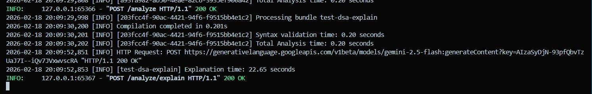
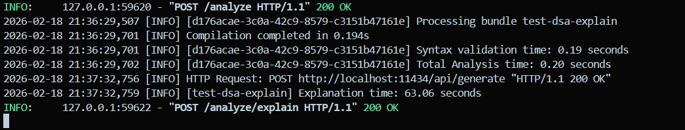
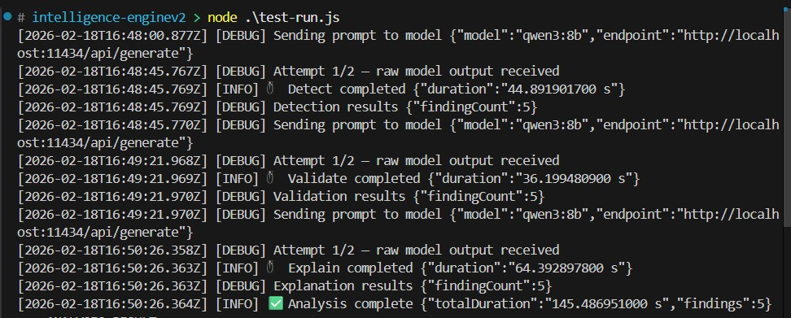
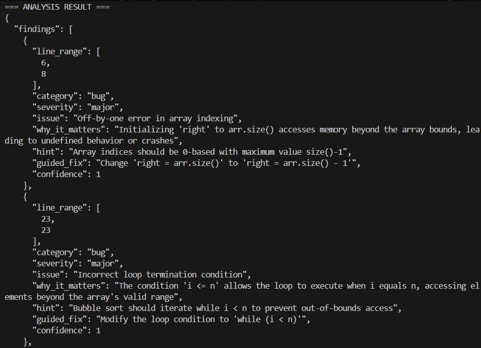
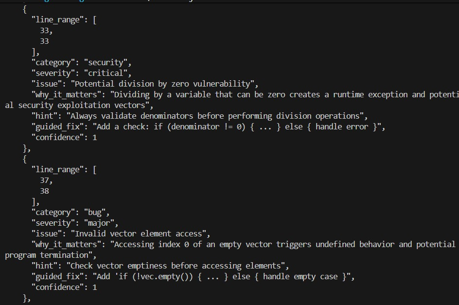
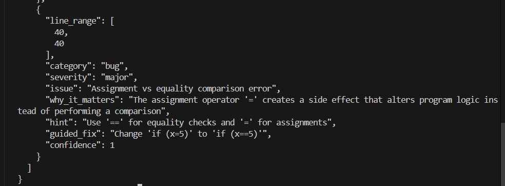
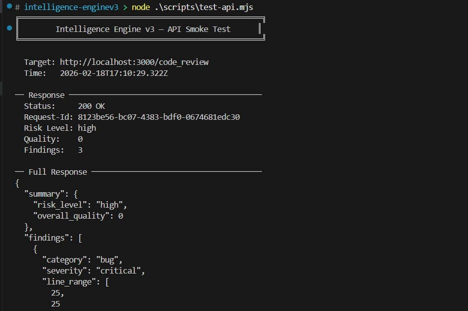
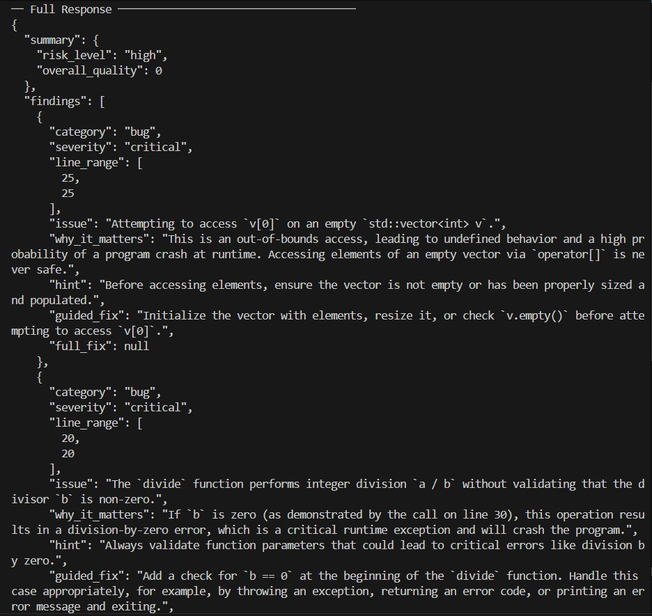
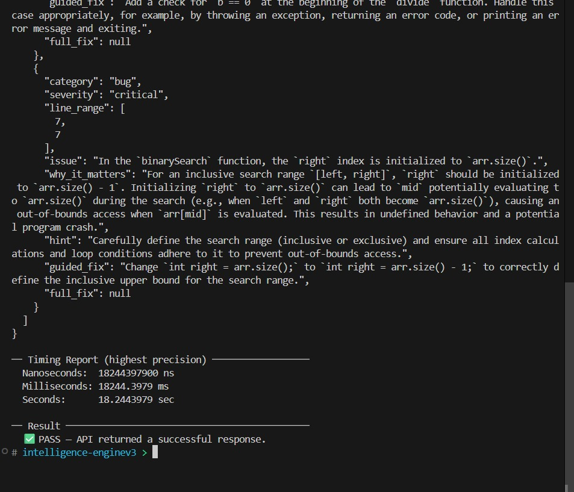

# AI Coding Assistant Brief

## v1 — Python Hybrid Analyzer
- Validates C++ syntax using `g++`.
- Runs static rules to detect common bug/security patterns.
- First it compiles the code to catch syntax errors, using g++. If compilation fails, it captures the error output for analysis.
- Then applies regex-based rules for deeper analysis, particularly for runtime errors and common coding mistakes.
- Finally calls LLM (Gemini/Ollama - qwen3:8b) to generate explanations and guided fixes.

### Output Images
#### Explanation using Gemini:

#### Explanation using Ollama:

---

## v2 — Node.js Multi-Stage LLM Pipeline
- Accepts code and numbers lines for better issue referencing.
- Runs 3 LLM stages: **Detect → Validate → Explain**.
- Currently using same Ollama Qwen 3.8b model for all stages, but designed to allow different models per stage.
- Having different system prompts for each stage to optimize for the specific task (detection, validation, explanation).
- Enforces JSON structure with Zod and retries invalid model output.

### Output Images

---

## v3 — Node.js MVC Gemini Engine
- Uses Express 5 MVC + middleware for production-grade request handling.
- Sends a language-aware single-pass prompt to Gemini.
- Normalizes/cleans model response before returning API output.

### Output Images

## Github Repository (dev - branch)
- https://github.com/DeepPatel4505/MentiCode-Backend.git