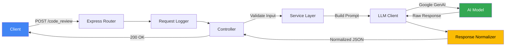

# ⚡ Intelligence Engine v3

**AI-Powered Code Review Microservice**

[](https://nodejs.org/)
[](https://expressjs.com/)
[](https://ai.google.dev/)
[](./LICENSE)

A production-ready HTTP microservice that performs AI-assisted code review using Google's Generative AI and returns a **normalized JSON contract** for downstream applications.

[Getting Started](#-getting-started) · [API Reference](#-api-reference) · [Configuration](#%EF%B8%8F-configuration) · [Architecture](#-architecture)

</div>

---

## ✨ Features

- 🤖 **AI-Powered Analysis** — Leverages Google GenAI for intelligent code review covering bugs, design, security, performance, and style
- 📋 **Normalized JSON Contract** — Consistent, typed response schema enforced regardless of LLM output variance
- 🛡️ **Production Hardened** — Centralized error handling, request validation, payload size limits, and LLM timeout protection
- 📊 **Structured Logging** — JSON-formatted request/error logs with nanosecond-precision timing, ready for log aggregation
- 🔄 **Graceful Shutdown** — Clean SIGTERM/SIGINT handling for zero-downtime deployments
- ❤️ **Health Checks** — Built-in `/health` endpoint for container orchestration and monitoring
- ⚙️ **Centralized Config** — Single-source configuration with environment variable support and fail-fast validation

---

## 🚀 Getting Started

### Prerequisites

- **Node.js** ≥ 20.x
- **npm** ≥ 10.x
- A valid **Google GenAI API key** ([Get one here](https://aistudio.google.com/apikey))

### Installation

```bash
# Clone the repository
git clone https://github.com/your-org/intelligence-enginev3.git
cd intelligence-enginev3

# Install dependencies
npm install
```

### Environment Setup

```bash
# Copy the example env file
cp src/.env.example src/.env
```

Edit `src/.env` and add your API key:

```env
GEMINI_API_KEY=your_api_key_here
PORT=3000
NODE_ENV=development
```

### Run the Service

```bash
# Development (with hot-reload via nodemon)
npm run dev

# Production
npm start
```

You should see:

```json
{"level":"info","msg":"HTTP server started","port":3000,"env":"development"}
```

---

## 📡 API Reference

### Health Check

```
GET /health
```

**Response** `200 OK`

```json
{
  "status": "ok",
  "env": "development"
}
```

---

### Code Review

```
POST /code_review
```

Submit source code for AI-powered analysis.

**Request Headers**

| Header         | Value              |
| -------------- | ------------------ |
| `Content-Type` | `application/json` |

**Request Body**

| Field      | Type     | Required | Description                              |
| ---------- | -------- | -------- | ---------------------------------------- |
| `language` | `string` | ✅        | Programming language of the code snippet |
| `code`     | `string` | ✅        | Source code to review (max 50,000 chars)  |

```json
{
  "language": "javascript",
  "code": "function add(a, b) { return a - b; }"
}
```

**Response** `200 OK`

```json
{
  "summary": {
    "risk_level": "low | medium | high",
    "overall_quality": 0
  },
  "findings": [
    {
      "category": "bug | design | security | performance | style",
      "severity": "minor | major | critical",
      "line_range": [1, 1],
      "issue": "Description of the issue",
      "why_it_matters": "Impact explanation",
      "hint": "Direction toward the fix",
      "guided_fix": "Step-by-step fix guidance",
      "full_fix": null
    }
  ]
}
```

**Error Responses**

| Status | Description                              |
| ------ | ---------------------------------------- |
| `400`  | Missing or invalid `language` / `code`   |
| `413`  | Code payload exceeds 50,000 character limit |
| `502`  | LLM service unavailable or returned an empty response |
| `504`  | LLM request timed out                    |

---

## ⚙️ Configuration

All configuration is managed via environment variables. The service uses [`dotenv`](https://github.com/motdotla/dotenv) for local development.

| Variable         | Required | Default                        | Description                                      |
| ---------------- | -------- | ------------------------------ | ------------------------------------------------ |
| `GEMINI_API_KEY`  | ✅        | —                              | Google GenAI API key                              |
| `PORT`           | ❌        | `3000`                         | HTTP server port                                  |
| `NODE_ENV`       | ❌        | `development`                  | Environment (`development`, `production`, `test`) |
| `LLM_MODEL`     | ❌        | `deepseek-coder:6.7b-instruct` | Model identifier for GenAI                        |
| `LLM_TIMEOUT_MS` | ❌        | `20000`                        | Max wait time for LLM response (ms)               |

> [!NOTE]
> The service **fails fast** on startup if `GEMINI_API_KEY` is missing (except in `test` environment). Never commit secrets — use environment variables or a secret manager in production.

---

## 🏗 Architecture

```
intelligence-enginev3/
├── src/
│   ├── index.js                  # HTTP server bootstrap & graceful shutdown
│   ├── app.js                    # Express app setup & middleware pipeline
│   ├── config/
│   │   └── config.js             # Centralized configuration & env validation
│   ├── controllers/
│   │   └── codeReviewController.js  # Request validation & orchestration
│   ├── routes/
│   │   └── codeReviewRoutes.js   # Route definitions
│   ├── services/
│   │   └── codeReviewService.js  # Business logic & LLM coordination
│   ├── middleware/
│   │   ├── requestLogger.js      # Structured request logging
│   │   ├── errorHandler.js       # Centralized error handling
│   │   └── notFoundHandler.js    # 404 catch-all
│   └── utils/
│       ├── myLLMClient.js        # Google GenAI client with timeout
│       ├── prompt.js             # Prompt engineering template
│       └── cleanResponse.js      # LLM response normalization
├── scripts/
│   ├── healthcheck.mjs           # Healthcheck script for orchestrators
│   └── test-api.mjs              # Quick API smoke test
├── test/
│   └── cleanResponse.test.js     # Unit tests
├── package.json
└── .gitignore
```

### Request Flow



---

## 🧪 Testing

```bash
# Run unit tests
npm test

# API smoke test (requires running server)
npm run test:api

# Health check
npm run healthcheck
```

---

## 🚢 Production Deployment

### Recommended Setup

- **Reverse Proxy** — Run behind Nginx, Traefik, or an API gateway for TLS termination, authentication, and rate limiting
- **Log Aggregation** — All logs emit to `stdout` as JSON; collect via your platform (Kubernetes, ECS, Cloud Run, etc.)
- **Timeout Tuning** — Set `LLM_TIMEOUT_MS` appropriately to protect against long upstream LLM calls
- **Container Health** — Use the built-in healthcheck script with Docker's `HEALTHCHECK` directive

### Docker Health Check

```dockerfile
HEALTHCHECK --interval=30s --timeout=5s --retries=3 \
  CMD node ./scripts/healthcheck.mjs
```

### Graceful Shutdown

The service handles `SIGTERM` and `SIGINT` signals, draining in-flight requests before exiting — compatible with Kubernetes pod termination, ECS task stopping, and most orchestrators.

---

## 🤝 Contributing

1. **Fork** the repository
2. **Create** a feature branch (`git checkout -b feature/amazing-feature`)
3. **Commit** your changes (`git commit -m 'Add amazing feature'`)
4. **Push** to the branch (`git push origin feature/amazing-feature`)
5. **Open** a Pull Request

---

## 📄 License

This project is licensed under the **ISC License** — see the [LICENSE](./LICENSE) file for details.

---

<div align="center">

**Built with ❤️ as part of the [MentiCode](https://github.com/your-org/MentiCode) platform**

</div>
]]>
